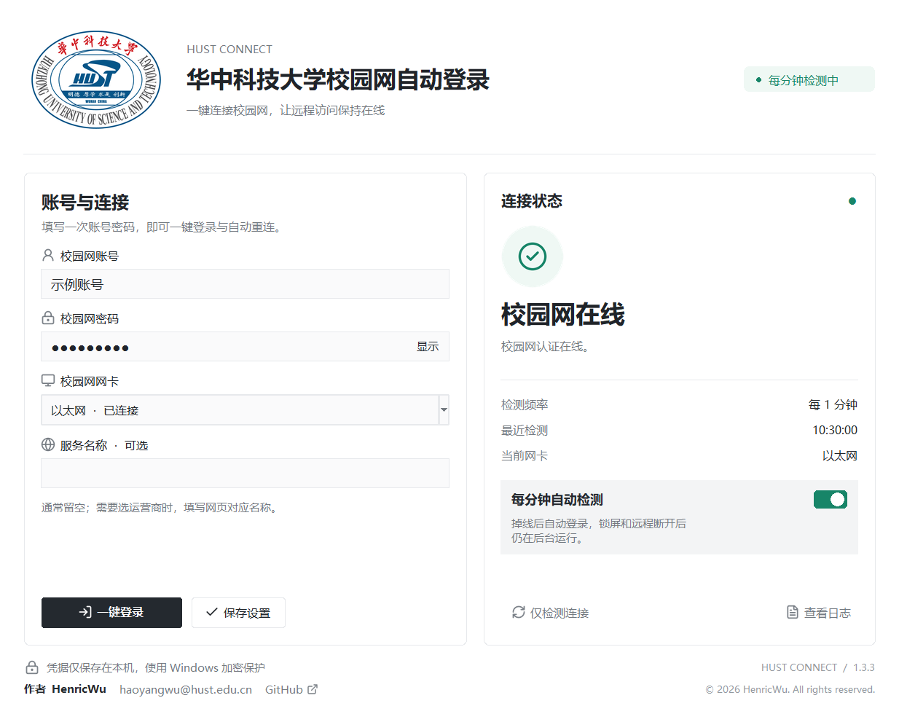

<div align="center">


# HUST Connect

**华中科技大学校园网自动登录**

一键登录 · 每分钟检测 · 掉线自动重连 · Windows 开机后台运行

[下载安装包](https://github.com/HenricWu/hust-campus-autologin/releases/latest) · [快速开始](#快速开始) · [常见问题](#常见问题) · [更新记录](CHANGELOG.md)

</div>

电脑放在工位，通过远程控制使用，但月初校园网认证失效后必须到现场重新登录？HUST Connect 会在电脑上定时检查校园网认证，在需要登录时尝试自动恢复连接。

首次填好账号并开启自动检测后，关闭软件窗口、锁屏或断开远程控制，后台任务仍会运行。

[](https://raw.githubusercontent.com/HenricWu/hust-campus-autologin/v1.3.3/docs/interface-v1.3.3.png)

[查看原始分辨率 PNG](https://raw.githubusercontent.com/HenricWu/hust-campus-autologin/v1.3.3/docs/interface-v1.3.3.png) · 1234 × 980 像素

*界面示意，使用虚构账号。作者：**HenricWu** · **haoyangwu@hust.edu.cn***

## 使用前确认

| 项目 | 要求 |
| --- | --- |
| 系统 | Windows 10 / 11；安装时需要管理员权限 |
| 运行环境 | **Python 3.10 或更新版本，包含 Tkinter**；本机在 Python 3.13 上验证 |
| 网络 | 电脑已经通过网线或 Wi-Fi 接入校园网 |
| 认证入口 | 当前适配 `http://172.18.18.60:8080` 的锐捷 ePortal |
| 账号 | 可以正常在校园网网页登录的账号与密码 |

> 下载包需要先安装 Python。程序只使用 Python 标准库，无须另外运行 `pip install`。

## 快速开始

### 1. 下载并解压

进入 [Releases 下载页](https://github.com/HenricWu/hust-campus-autologin/releases/latest)，展开 **Assets**，下载：

**`HUST-Connect-v1.3.3-Windows.zip`**

右键选择 **全部解压**，打开解压后的 `CampusAutoLogin` 文件夹。安装前请先解压完整文件夹。

### 2. 准备 Python

已经安装 Python 且 `python` 命令可以正常使用的电脑可直接进入下一步。

未安装时，前往 [Python 官方 Windows 下载页](https://www.python.org/downloads/windows/) 下载适合电脑的 **Windows installer**。使用常规安装程序时，勾选 **Add python.exe to PATH**，并保留 **Tcl/Tk and IDLE** 组件。

在终端运行以下命令，可以检查环境：

```powershell
python -c "import sys, tkinter; print(sys.version)"
```

能显示版本号且没有报错，即可继续。若命令打开 Microsoft Store，请先安装完整 Python 并确认 PATH 配置。

### 3. 安装到本机

右键 **`一键安装.cmd`**，选择 **以管理员身份运行**，在 Windows 权限提示中选择 **是**。安装完成后会创建桌面快捷方式并打开设置窗口。

安装会将程序复制到 `%ProgramData%\CampusAutoLogin`，并注册开机及每分钟运行的后台任务。日常使用不需要终端。

如果脚本安装失败，可以在解压目录打开**管理员 PowerShell**，运行：

```powershell
powershell -NoProfile -ExecutionPolicy Bypass -File .\install.ps1
```

### 4. 填写账号并登录

| 设置项 | 怎么填写 |
| --- | --- |
| 校园网账号 | 与校园网登录网页相同的账号 |
| 校园网密码 | 对应的校园网密码 |
| 校园网网卡 | 选择实际接入校园网的网卡，例如 **以太网** 或 **Wi-Fi** |
| 服务名称 | 通常留空；网页要求选择运营商/服务时，填写对应名称 |

点击 **一键登录**。程序会保存设置、检测认证状态，并在需要认证时提交登录；已在线时直接确认状态。

首次保存后会默认开启 **每分钟自动检测**。已有配置的电脑会保留原来的开关状态。

### 5. 确认后台已生效

确认界面右侧：

- 显示 **校园网在线** 或 **连接已恢复**。
- **每分钟自动检测** 开关已打开。
- **最近检测** 时间持续更新，通常约一分钟更新一次。

之后可以关闭设置窗口。需要修改账号时，再双击桌面上的 **华中科技大学校园网自动登录**。

## 按钮与开关

| 操作 | 用途 |
| --- | --- |
| **一键登录** | 保存当前设置，立即检查并按需登录。自动检测关闭时也可使用 |
| **保存设置** | 保存账号和网卡，清除旧的失败等待状态；不立即提交登录 |
| **每分钟自动检测** | 开启或暂停后台自动检查与重连 |
| **仅检测连接** | 只查询当前认证状态，不提交登录 |
| **查看日志** | 打开本机的配置、状态和日志目录 |
| **底部邮箱** | 点击复制作者联系邮箱 |
| **GitHub ↗** | 打开作者维护的项目仓库 |

## 月初断网时会发生什么

1. Windows 后台任务每 60 秒运行一次，检查指定网卡的校园网认证状态。
2. 如果认证已失效，程序获取新的登录参数，并使用已保存的账号尝试登录。
3. 成功后显示 **连接已恢复**，后续继续每分钟检测。
4. 若服务器暂时拒绝登录，会延长提交间隔：5、15、60、180、360 分钟，之后每 6 小时继续尝试。检测仍按分钟执行。

明确的账号/密码错误或验证码需要人工处理。修改账号信息后点击 **一键登录**，可清除此前的失败等待状态并重新尝试。

## 常见问题

**关闭窗口、锁屏或远程控制断开，会停止吗？**  
不会。后台任务由 Windows 计划任务执行，不依赖设置窗口，也不需要保持交互登录 Windows。

**电脑关机或睡眠后还能重连吗？**  
不能在关机或睡眠期间执行。开机或恢复后继续检测。需要全天远程访问时，请保持电脑开机、网线连接，并检查 Windows 睡眠设置。

**为什么显示“等待校园网”？**  
先确认网线/Wi-Fi 正常，再检查选择的网卡是否正确。多网卡电脑应选择连接校园网的物理网卡。

**为什么提示认证失败、需要处理或验证码？**  
先在校园网网页确认账号、密码、服务名称和账号状态。验证码需在网页处理。网页能正常登录但软件不能登录时，可通过 Issues 反馈状态码和脱敏日志。

**显示在线，但远程控制仍然连不上？**  
“在线”表示校园网认证服务器返回已认证，不代表远程控制软件或外网链路均正常。请检查远程控制软件是否开机运行、网络服务是否可用。

**重新安装后要再次填写密码吗？**  
在同一 Windows 用户下升级或重新安装，会保留已保存的设置。移动/卸载 Python 后，需要重新运行安装程序以更新后台任务使用的路径。

**可以用于其他学校或其他入口吗？**  
当前只针对上述 HUST ePortal 入口实现。即使其他校园网也使用锐捷，登录协议仍可能不同，需要单独适配。

**为什么安装需要管理员权限？**  
需要创建 SYSTEM 后台任务，以便开机、锁屏和未登录 Windows 时也能恢复认证。

## 升级与卸载

**升级：**下载新版本、全部解压、关闭旧设置窗口，再右键 `一键安装.cmd` 选择 **以管理员身份运行**。同一用户的账号、密码和自动检测开关会保留。

**卸载：**在项目目录打开管理员 PowerShell，执行：

```powershell
powershell -NoProfile -ExecutionPolicy Bypass -File .\uninstall.ps1
```

同时清除已保存的加密账号：

```powershell
powershell -NoProfile -ExecutionPolicy Bypass -File .\uninstall.ps1 -ForgetCredentials
```

卸载会移除计划任务和桌面快捷方式，保留源文件与日志，不会注销当前校园网连接。

## 数据与隐私

- 账号和密码整体使用 Windows DPAPI 本机范围加密；数据目录限安装用户、SYSTEM 和管理员访问。
- 运行数据位于 `%ProgramData%\CampusAutoLogin\data\<安装用户名>`；下载包和 Git 仓库中不包含个人凭据。
- 日志不记录账号、密码、会话标识或认证请求内容。程序没有遥测，不上传运行数据。
- 凭据只向当前适配的固定校园网认证接口提交；不会发送给网页重定向到的其他主机。
- 提交 Issues 前请隐藏账号、IP、设备信息和其他个人数据，不要上传运行数据目录。
- 当前版本按单用户安装设计，不作为同一电脑多 Windows 用户的部署方案。

## 开发与验证

程序仅依赖 Python 标准库。源文件 `campus_login.py` 包含认证逻辑和 Tkinter 设置界面。

```powershell
python -m unittest discover -s tests -v
python tests/check_gui_actions.py
```

已通过 20 项核心测试，覆盖凭据加密、共享锁、网卡选择、跳转白名单、RSA 协议、重连、退避、验证码及手动/自动控制。界面联动测试使用模拟认证服务器，示例图使用虚构账号。

本机在线检测、计划任务、白色界面和安装流程已检查。真实月初认证清退和重启后的完整恢复链路仍需实际运行验证；测试没有主动注销真实校园网连接。

详细本机验证记录见 [验证记录.json](验证记录.json)，补充操作说明见 [使用说明.md](使用说明.md)。

## 作者与支持

**HenricWu** · [GitHub](https://github.com/HenricWu) · **haoyangwu@hust.edu.cn**

反馈问题请到 [Issues](https://github.com/HenricWu/hust-campus-autologin/issues)，说明 Windows/Python 版本、界面状态、复现步骤，并附脱敏后的错误信息。

---

**© 2026 HenricWu. All rights reserved.**

[版权声明](NOTICE.md) · [校徽与资源来源](校徽来源.md) · [图标许可](assets/icons/LUCIDE-LICENSE.txt)
